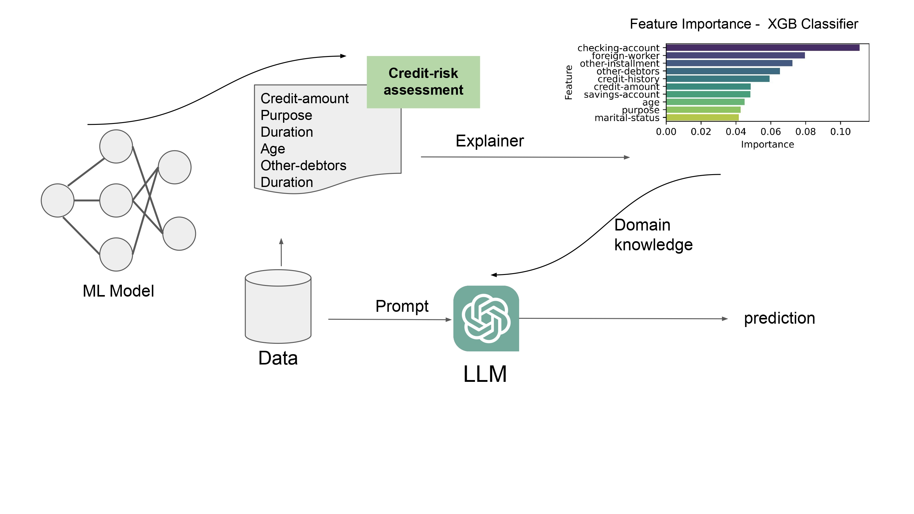

# ChatGPT-FairXAI
"GPT-FairXAI" investigates the potential of Large-scale Language Models (LLMs) like OpenAI's GPT in the domain of credit risk assessment. Our findings suggest that when judiciously designed prompts and domain-specific knowledge are integrated, LLMs can achieve parallel performance to traditional ML models—while requiring significantly less data.

This paper has been accepted to the workshop on "Challenges and Opportunities of Large Language Models in Real-World Machine Learning Applications", COLLM@ECML-PKDD'23: https://collm2023.github.io/

Link to the paper: [https://doi.org/10.48550/arXiv.2307.11761]

```
@article{deldjoo2023Explainable,
  author       = {Yashar Deldjoo},
  title        = {Fairness of ChatGPT and the Role Of Explainable-Guided Prompts},
  journal      = {CoRR},
  volume       = {abs/2307.11761},
  year         = {2023},
  url          = {https://doi.org/10.48550/arXiv.2307.11761},
  doi          = {10.48550/arXiv.2307.11761},
  eprinttype    = {arXiv},
}
```

</br>

<div align="center">
  <figure style="display: inline-block;">
    
  </figure>
</div>

</br>

---
### 📊 **Research Summary: Fairness of ChatGPT in Credit Risk Assessment**

🔍 **Key Insights**:

1. 📈 ChatGPT performs competitively in credit risk assessment even with 40 times less data compared to traditional ML models.
2. 🏦 Prompt engineering and domain-specific knowledge enhance performance metrics.
3. 🚨 ChatGPT seems to excel in enhancing fairness with good prompt design. 

---

🌟 **Summary**: 
> We investigate the role of Large-scale Language Models in credit risk assessment. Despite having significantly less data—merely 20 data points as opposed to the 800 used by traditional models—the OpenAI-based models produced competitive results. Particularly, they excelled in reducing False Positive costs, a critical metric in credit risk assessment. Our findings lay the groundwork for the potential of LLMs in various machine-learning tasks, especially those requiring fairness and efficiency.
---


